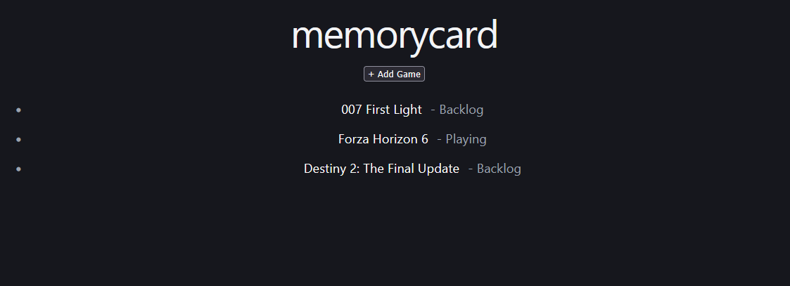
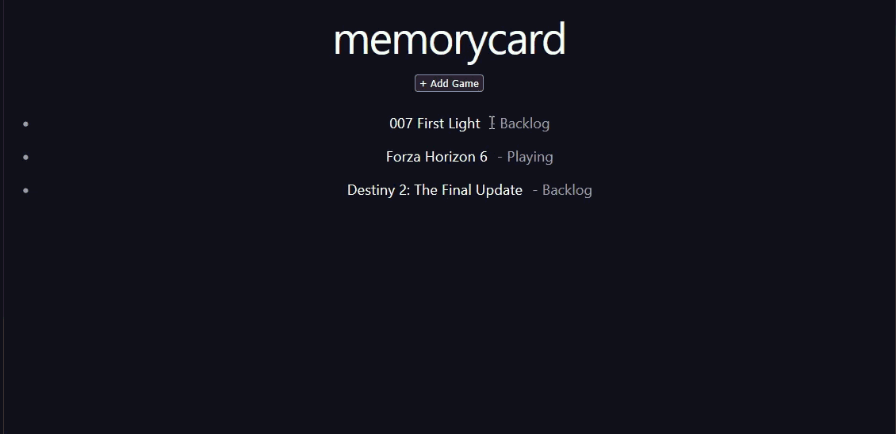
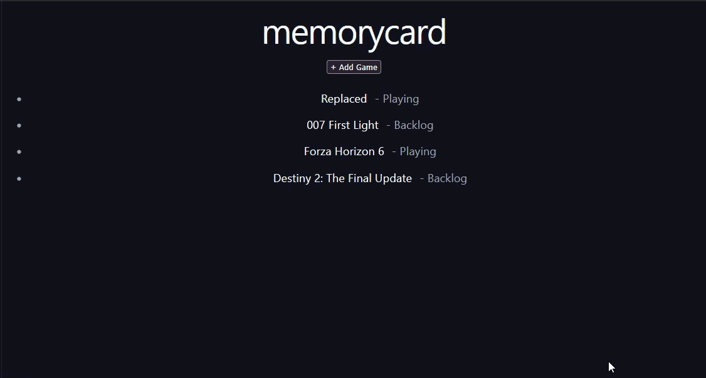
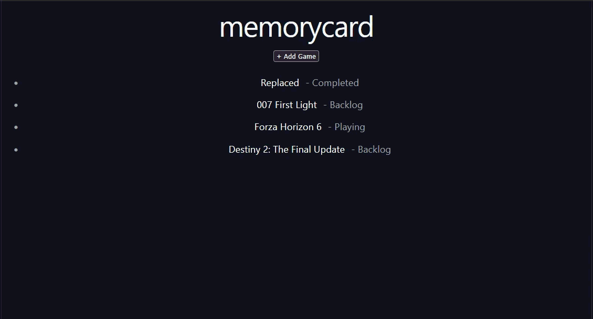

# memorycard

memorycard is a full-stack web application for tracking video games that users have played, are currently playing, or plan to play in the future.

Choosing what video game I want to pick up next has been a problem for me as long as I can remember. This personal repo will help me keep track of all titles that piqued my interest and want to visit later down the line.

The project was built to gain hands-on experience with modern full-stack development technologies using AI assisted development and common software engineering practices, including REST APIs, 
relational databases, frontend-backend integration, and source control workflows.


## Features

### Current Features

- View all games in a personal collection
- Add games to the collection
- Persist data in PostgreSQL
- REST API built with Express
- React frontend consuming backend APIs
- (New) Delete games from the collection

## Preview
Home page


<details close> <Summary> <H3> Click here for more previews </H3> </Summary>

### Add Game


### Edit Game


### Delete Game


</details>

### Planned Features

- ~~Delete games from the collection~~ - Completed ✓
- ~~Edit game status~~ - Completed ✓
- Search games by title
- Filter by status
- User authentication

## Current Status

MVP in active development.

Completed:
- Database integration
- Create game functionality
- View game collection
- Delete game functionality
- Frontend/backend integration
- Update game status

Currently Working On:
- Search and filtering
- UI improvements

## Tech Stack

### Frontend

- React
- TypeScript
- Vite

### Backend

- Node.js
- Express
- TypeScript

### Database

- PostgreSQL

### Development Tools

- Github Copilot
- Git
- GitHub
- VS Code


## Architecture

```text
┌─────────────┐
│   React UI  │
└──────┬──────┘
       │ HTTP Requests
       ▼
┌─────────────┐
│ Express API │
└──────┬──────┘
       │ SQL Queries
       ▼
┌─────────────┐
│ PostgreSQL  │
└─────────────┘
```

The frontend communicates with the backend through REST endpoints. The backend handles business logic and database operations before returning JSON responses to the client.


## Project Goals

This project is focused on developing practical experience with:

- Full-stack application development
- REST API design
- PostgreSQL database integration
- React state management
- CRUD operations
- Git-based development workflows
- Backend debugging and troubleshooting


## What I Learned

Some concepts explored while building this project:

- Setting up a React and Express application from scratch
- Connecting Node.js applications to PostgreSQL
- Creating RESTful API endpoints
- Managing frontend state with React hooks
- Working with environment variables
- Debugging backend connectivity issues
- Using Git and GitHub for version control


## Future Improvements

Potential enhancements include:

- User accounts
- Ratings and reviews
- Game metadata integration